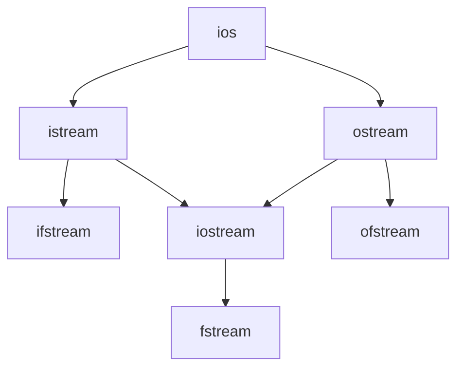

**Structured Summary: File Handling in C++**

In this video, the presenter discusses the importance of file handling in C++ programming and outlines the basic concepts involved in reading from and writing to files.

**1. Introduction to File Handling:**
   - File handling allows storing program output in permanent storage, such as a hard disk, ensuring data persistence beyond program execution.
   - Without file handling, program output stored in variables is lost once the program ends.

**2. Basic File Handling Operations:**
   - The first step in file handling is to open a file in the RAM using appropriate classes.
   - For writing data to a file, an object of the `ofstream` class is used, representing an output stream.
   - Similarly, for reading data from a file, an object of the `ifstream` class is used, representing an input stream.

**3. Understanding Streams:**
   - Streams are represented by various classes, including `ios`, `istream`, and `ostream`.
   - The `iostream` class combines the functionalities of both input and output streams.
   - `ifstream` is used for reading data from files, while `ofstream` is used for writing data to files.
   - The `fstream` class combines functionalities of both `ifstream` and `ofstream`.
<br><br>

<br><br>

**4. Example Code:**
```cpp
#include <iostream>
#include <fstream>
using namespace std;

int main() {
    ofstream outFile; // Creating an object of ofstream class for writing to file

    // Opening a file named "output.txt"
    outFile.open("output.txt");

    // Writing data to the file
    outFile << "This is some data written to the file.";

    // Closing the file
    outFile.close();

    cout << "Data written to file successfully." << endl;

    return 0;
}
```

**5. Conclusion and Next Steps:**
   - The presenter concludes by highlighting the importance of learning file handling in C++ and promises to delve deeper into writing data to a file in the next video.